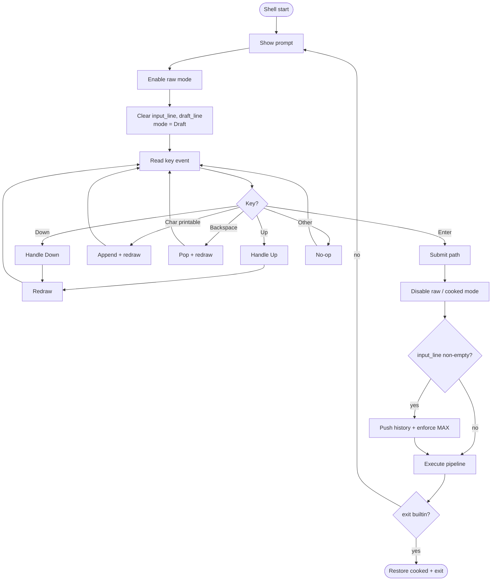
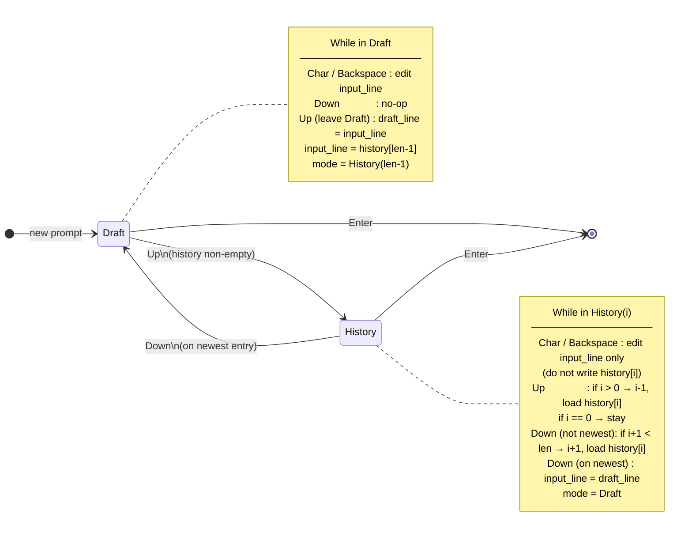

# Wish

Educational shell. Cursor always at end of line. No Left/Right for now.

## Edge-case index

| ID | Topic | Section |
|----|--------|---------|
| [E-RAW](#e-raw) | Raw / cooked lifecycle | [1. Terminal mode](#1-terminal-mode) |
| [E-HIST](#e-hist) | History store & MAX | [2. History store](#2-history-store) |
| [E-STATE](#e-state) | Line state & pointer | [3. Line state](#3-line-state) |
| [E-KEY](#e-key) | Keystroke handling | [4. Keystroke loop](#4-keystroke-loop) |
| [E-UP](#e-up) | Up arrow | [5. Up](#5-up) |
| [E-DOWN](#e-down) | Down arrow | [6. Down](#6-down) |
| [E-CHAR](#e-char) | Printable char | [7. Char](#7-char) |
| [E-BS](#e-bs) | Backspace | [8. Backspace](#8-backspace) |
| [E-ENTER](#e-enter) | Enter / submit | [9. Enter](#9-enter) |
| [E-DRAW](#e-draw) | Redraw | [10. Redraw](#10-redraw) |

---

## Flow (mermaid)





---

## 1. Terminal mode

**Rules**

- Raw on while collecting a line (prompt → Enter).
- Cooked before execute and on any shell exit/panic path.

### E-RAW

| Case | Action |
|------|--------|
| Start of prompt | Enable raw |
| Enter pressed | Disable raw before execute |
| `exit` builtin | Restore cooked, then exit |
| Panic / fatal error | Restore cooked if possible |
| Child process running | Must be cooked so interactive programs work |

### TODOs

- [x] Enable raw mode at start of each prompt read
- [x] Disable raw mode before `execute`
- [x] Restore cooked on `exit`
- [ ] Restore cooked on panic/error unwind (scope guard or equivalent)

---

## 2. History store

**Rules**

- `history: Vec<String>` — oldest → newest.
- Mutate **only** on successful Enter submit (not on Up/Down/edit).
- Push only non-empty lines.
- Optional: skip push if equal to last entry.
- MAX: drop oldest when over limit.

### E-HIST

| Case | Action |
|------|--------|
| Empty `input_line` on Enter | Do not push |
| Equal to `history.last()` | Do not push (policy) |
| `len > MAX` after push | Remove from front until `len <= MAX` |
| Empty history + Up/Down | No-op (see E-UP / E-DOWN) |

### TODOs

- [ ] Add `history: Vec<String>` and `const MAX_HISTORY`
- [ ] `push_history(line)` with empty / duplicate / MAX rules
- [ ] Never mutate history inside key handlers except Enter path

---

## 3. Line state

**Rules**

```text
input_line   // current prompt buffer (what user sees / will submit)
draft_line   // snapshot of what user typed before first Up from Draft
mode         // Draft | History(usize)   // or history_ptr: Option<usize>
             // None / Draft = drafting; Some(i) = viewing history[i]
```

- After Enter (next prompt): `input_line = ""`, `draft_line = ""`, `mode = Draft` (`history_ptr = None`).
- History entries are **copied** into `input_line`; edits do not write back until Enter pushes a new entry.

### E-STATE

| Case | Action |
|------|--------|
| New prompt | All clear; `mode = Draft` |
| Edit while `History(i)` | Only change `input_line` (copy); leave `history[i]` unchanged |
| `draft_line` overwrite | Only on first Up leaving Draft — not on every Up |

### TODOs

- [ ] Define state fields (`input_line`, `draft_line`, `history_ptr` / mode)
- [x] Reset state at start of each prompt
- [ ] Document: `history_ptr = None` after Enter / on new prompt

---

## 4. Keystroke loop

**Rules**

- Per-keystroke detect → match → update state → (usually) redraw.
- Not: wait for full line then interpret.

```text
loop {
  event = read_key()
  match event { Up | Down | Char | Backspace | Enter | _ }
  if Enter { break }
}
```

### E-KEY

| Case | Action |
|------|--------|
| Unknown / non-printable / modifiers-only | No-op |
| Left / Right / Home / End / F-keys | No-op (for now) |
| Ctrl-C / Ctrl-D | Out of scope unless you add them later |

### TODOs

- [x] Replace `read_line` with raw key event loop (e.g. crossterm)
- [ ] Match only: Up, Down, Char(printable), Backspace, Enter
- [x] Default arm: no-op

---

## 5. Up

**Rules**

```text
if history.is_empty() → no-op
if Draft:
  draft_line = input_line
  i = len - 1
  input_line = history[i]
  mode = History(i)
if History(i):
  if i > 0 → i -= 1; input_line = history[i]
  if i == 0 → stay
redraw
```

### E-UP

| Case | Action |
|------|--------|
| Empty history | No-op |
| Draft → first Up | Save `draft_line`, load newest |
| Already on oldest (`i == 0`) | Stay; still ok to redraw |
| Further Up | Move toward older only |

### TODOs

- [ ] Implement Up handler per rules above
- [ ] Snapshot `draft_line` only when leaving Draft
- [ ] Redraw after successful state change (and optionally on no-op)

---

## 6. Down

**Rules**

```text
if Draft → no-op
if History(i):
  if i + 1 < len → i += 1; input_line = history[i]
  if i == len - 1 (newest):
    input_line = draft_line
    mode = Draft
redraw
```

### E-DOWN

| Case | Action |
|------|--------|
| In Draft | No-op |
| Middle of history | Load newer entry |
| On newest + Down | Restore `draft_line`, `mode = Draft` |
| Empty history | N/A if never entered History; if somehow History, treat as no-op |

### TODOs

- [ ] Implement Down handler per rules above
- [ ] Restore draft when leaving newest downward
- [ ] Redraw after change

---

## 7. Char

**Rules**

- Printable only → `input_line.push(c)` → redraw.
- Works in Draft and History (edits the copy).

### E-CHAR

| Case | Action |
|------|--------|
| Non-printable / control | No-op |
| While browsing history | Append to `input_line` only; do not write `history[i]` |

### TODOs

- [ ] Accept `KeyCode::Char(c)` when `c.is_printable()` (or equivalent)
- [x] Append + redraw

---

## 8. Backspace

**Rules**

- If `input_line` non-empty → pop last → redraw.
- If empty → no-op (do not erase into prompt).

### E-BS

| Case | Action |
|------|--------|
| Empty `input_line` | No-op |
| Non-empty | Pop one char + redraw |
| While History | Same; still only mutates `input_line` |

### TODOs

- [x] Implement Backspace with empty guard
- [x] Redraw (never move cursor into prompt)

---

## 9. Enter

**Rules**

```text
1. Disable raw (cooked)
2. if !input_line.is_empty()
     && input_line != history.last()   // optional duplicate skip
   → push; enforce MAX
3. execute(input_line)   // existing Wish pipeline
4. Next prompt resets: input_line/draft clear, mode = Draft (ptr = None)
```

Empty line: no push; re-prompt.

### E-ENTER

| Case | Action |
|------|--------|
| Empty line | No history push; execute no-op or skip exec; new prompt |
| Non-empty | Push (policy) then execute |
| `exit` | Cooked already on; cleanup + return |
| After any submit | Next read starts with `history_ptr = None` (not on newest) |

### TODOs

- [x] Wire Enter to leave key loop
- [x] Cooked before execute
- [ ] Call `push_history` with E-HIST rules
- [x] Reuse existing execute/pipeline path
- [x] Ensure next prompt resets Draft state

---

## 10. Redraw

**Rules**

- After Char, Backspace, Up, Down (state change): show `prompt + input_line`.
- Simplest approach: clear current input area, reprint prompt + `input_line`.
- Cursor always at end.

### E-DRAW

| Case | Action |
|------|--------|
| Line shorter after Backspace / shorter history entry | Must clear trailing old characters (clear-to-eol or full line rewrite) |
| Prompt includes CWD | Reuse existing CWD prompt format |
| Empty `input_line` | Show prompt only |

### TODOs

- [x] Implement `redraw(prompt, input_line)`
- [x] Clear remnants when new line is shorter than old
- [ ] Call redraw from Char / Backspace / Up / Down

---

## Build order (suggested)

1. Terminal raw/cooked + restore on exit — [§1](#1-terminal-mode)
2. State + redraw helper — [§3](#3-line-state), [§10](#10-redraw)
3. Key loop: Char, Backspace, Enter (no history yet) — [§4](#4-keystroke-loop), [§7](#7-char), [§8](#8-backspace), [§9](#9-enter)
4. History push + MAX — [§2](#2-history-store)
5. Up / Down + draft — [§5](#5-up), [§6](#6-down)
6. Edge-case pass using index table at top

---

## Non-goals (for now)

- Left/Right cursor movement
- Persistent history file
- Ctrl-R search
- Multi-line input
- Syntax highlighting
