# Command history

In-session history for Wish: store submitted lines, browse with Up/Down, keep a draft of what the user was typing.

The line editor (raw mode, redraw, Enter) is documented in [Interactive line editing](interactive-line-editing.md).

## Store

- `history: Vec<String>` — **oldest → newest**
- Mutate **only** when the user submits a non-empty line (Enter path), not while browsing or editing
- Cap: `MAX_HISTORY_ITEMS`; when full, drop the **oldest** then push
- Skip push if the new line equals `history.last()`
- Empty submit (caller): do not push

| Case | Action |
|------|--------|
| Empty line on Enter | Do not push |
| Same as last entry | Do not push |
| At MAX | Remove front, then push |
| Empty history + Up/Down | No-op |

## Line state while editing

```text
input_line        // what is shown and will be submitted
draft_line        // text saved when leaving Draft on first Up
history_ptr_pos   // index into history; history.len() means Draft (past end)
shell_mode        // Draft | History
```

| Case | Action |
|------|--------|
| New prompt | Clear lines; Draft; `history_ptr_pos = history.len()` |
| Edit in History mode | Change `input_line` only; do not write back into `history[i]` until Enter pushes a new entry |
| Save draft | Only on first Up from Draft, not on every Up |

## Draft vs History

```mermaid
stateDiagram-v2
  direction LR

  [*] --> Draft: new prompt

  Draft --> History: Up\n(history non-empty)
  History --> Draft: Down\n(on newest entry)
  Draft --> [*]: Enter
  History --> [*]: Enter

  note right of Draft
    While in Draft
    ─────────────────
    Char / Backspace : edit input_line
    Down             : no-op
    Up (leave Draft) : draft_line = input_line
                       load newest history entry
                       mode = History
  end note

  note right of History
    While in History
    ─────────────────
    Char / Backspace : edit input_line copy only
    Up               : older entry; stop at oldest
    Down (not newest): newer entry
    Down (on newest) : restore draft_line
                       mode = Draft
  end note
```



## Up

```text
if history.is_empty() → no-op
if history_ptr_pos == 0 → no-op (already oldest)
if Draft:
  draft_line = input_line
  mode = History
input_line = history[history_ptr_pos - 1]
history_ptr_pos -= 1
redraw
```

| Case | Action |
|------|--------|
| Empty history | No-op |
| Draft → first Up | Snapshot draft, load newest |
| Already on oldest | Stay |
| Further Up | Move toward older |

## Down

```text
if history.is_empty() or Draft → no-op
if on newest (ptr == len - 1):
  input_line = draft_line
  clear draft_line
  history_ptr_pos = len
  mode = Draft
else:
  input_line = history[ptr + 1]
  history_ptr_pos += 1
redraw
```

| Case | Action |
|------|--------|
| In Draft | No-op |
| Middle of list | Load newer entry |
| On newest + Down | Restore draft, back to Draft |

## Submit and history

On non-empty Enter (after cooked mode):

1. `history_push` (duplicate / MAX rules above)
2. `execute_command`
3. Next prompt resets Draft state (`history_ptr_pos = history.len()`, empty draft/input)

Browsing never mutates the `history` vec; only Enter does.
