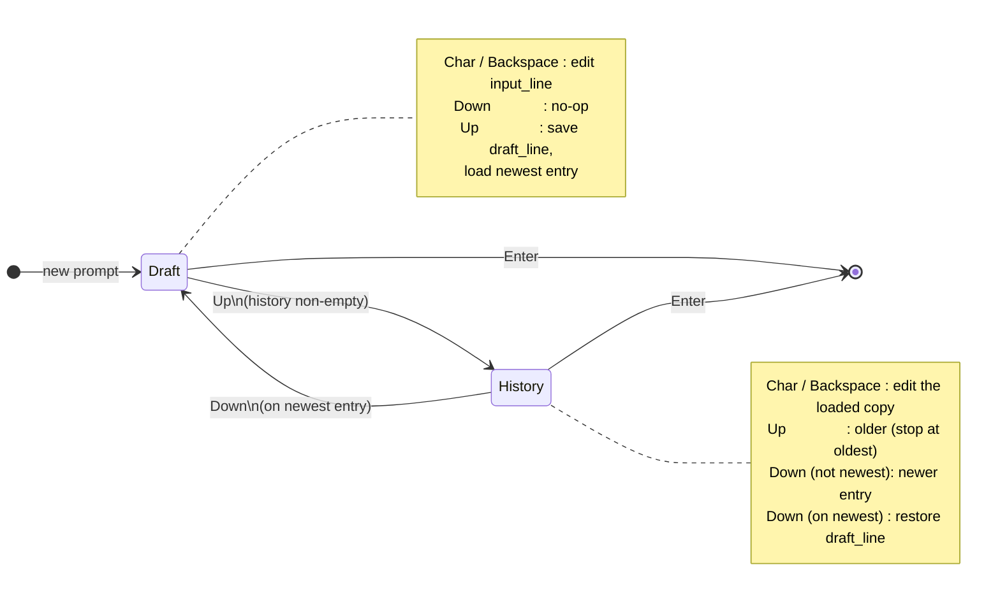

# Command history

In-session history: remember submitted lines, browse with Up/Down, and keep a **draft** of what the user was typing before they entered history.

Line editing context: [Interactive line editing](interactive-line-editing.md)

## Model

| Piece | Role |
|-------|------|
| `history` | Oldest → newest list of submitted lines |
| `input_line` | What is shown and will be submitted |
| `draft_line` | Snapshot of the draft when first leaving Draft via Up |
| `history_ptr_pos` | Index into history; `history.len()` means “past the end” (Draft) |
| `shell_mode` | `Draft` or `History` |

**Push rules** (only on non-empty Enter — never while browsing):

- Skip if the line equals the last history entry
- Cap at `MAX_HISTORY_ITEMS`; drop the oldest when full
- History is session-only (not written to disk)

Editing while in History changes `input_line` only; the stored `history[i]` entries are not rewritten until a later Enter pushes a new entry.

## Draft vs History

## Navigation

**Up** — no-op if history is empty or already on the oldest entry. On the first Up from Draft, save `input_line` into `draft_line`, then load newer→older entries as the user keeps pressing Up.

**Down** — no-op in Draft. From the newest history entry, restore `draft_line` and return to Draft; otherwise move toward newer entries.

After any history load, the caret moves to the end of the line.
