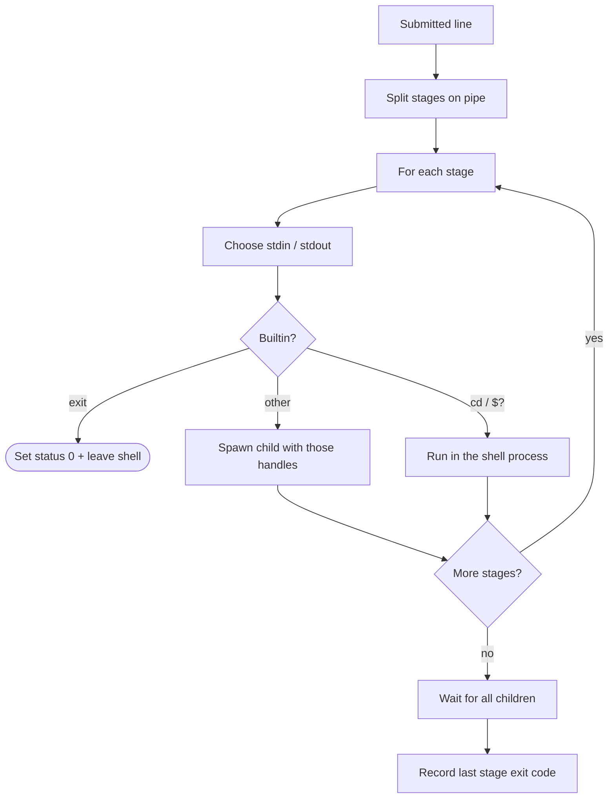

# Execution — pipelines, redirection, exit status

How Wish runs a line after the editor leaves raw mode.

Related: [Interactive line editing](interactive-line-editing.md)

## Flow

1. Split on `" | "` into pipeline **stages**.
2. For each stage, choose **stdin** and **stdout**.
3. Run builtins in-process; spawn everything else.
4. Wait for children; pipeline status = **last** stage’s exit code.
5. Store that status for the next prompt / `$?`.

## I/O wiring

| Stream | Default | File redirect |
|--------|---------|---------------|
| **stdin** | First stage: shell terminal; later: previous stage’s pipe (or EOF if there was no pipe) | `< file` — open for read |
| **stdout** | Pipe to the next stage, or the terminal if last | `>` truncate; `>>` append |

File redirects override pipe/inherit for that stream. At most one of `>>`, `>`, or `<` is applied per stage (`>>` before `>` so append is not mistaken for truncate).

### When the previous stage left no pipe

`previous_stdout` can be empty for two reasons:

1. **First stage** → inherit the shell’s stdin  
2. **Later stage**, after stdout went to a file → stdin is **EOF** (`Stdio::null()`), so e.g. `wc` does not hang on the terminal

## Builtins

| Command | Role |
|---------|------|
| `cd` | Change the shell’s working directory |
| `exit` | End the shell session |
| `$?` | Print the previous line’s exit status (teaching builtin, not `$` expansion) |
| *other* | External program via `Command::spawn` |

## Exit status

Wish keeps a single integer across prompts (bash-style “last pipeline status” = **last stage only**).

- After a pipeline finishes, that value becomes the last child’s exit code.
- `$?` prints the value from the **previous** line, then records success (`0`) for the `$?` invocation itself.
