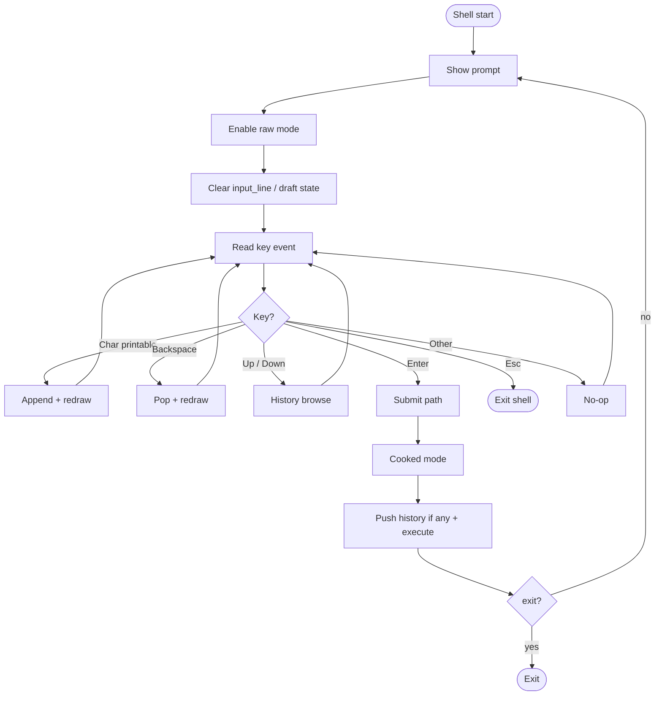

# Interactive line editing

How Wish reads a command line before execute. Cursor is currently always at the **end** of the line (Left/Right is planned later).

## Overview

1. Enter raw mode for the prompt (`TerminalRawMode` guard).
2. Show `prompt` + `input_line` (CWD + ` $ `).
3. Handle keys one at a time; redraw when the buffer changes.
4. On Enter: leave raw (cooked), then run the line (see also [Command history](command-history.md)).

## Flow



History Up/Down details: [Command history](command-history.md).

## Terminal mode (raw / cooked)

| Case | Action |
|------|--------|
| Start of prompt | Enable raw via `TerminalRawMode` guard |
| Guard drops | Disable raw (normal end of scope or panic unwind) |
| Before execute | Terminal must be cooked so children behave |
| `exit` / Esc | Leave shell; raw restored by drop / process end |

**Rules**

- Raw only while collecting the line.
- Prefer a RAII guard over scattered enable/disable calls.
- Manual cooked before execute is fine if the guard is still alive until end of the prompt iteration.

## Keystroke loop

Per keystroke: `match` on `KeyEvent` → update `input_line` (and related state) → redraw when needed.

Not: `read_line` and only act after Enter.

| Input | Action |
|-------|--------|
| Printable `Char(c)` (`!c.is_control()`) | Append to `input_line`, redraw |
| Control / unknown keys / mouse | No-op |
| Backspace | Pop last char if any, redraw |
| Enter | Submit (see below) |
| Esc | Exit shell |
| Up / Down | History (see [Command history](command-history.md)) |
| Left / Right | Not implemented yet |

## Backspace

| Case | Action |
|------|--------|
| Empty `input_line` | No-op (do not erase into the prompt) |
| Non-empty | Pop one character, redraw |

## Enter / submit

```text
1. Write \r\n (move to next screen line)
2. If input_line empty (trim) → new prompt, no execute
3. Cooked mode
4. Push history if policy allows (see [Command history](command-history.md))
5. execute_command(input_line)
6. If exit builtin → leave shell; else next prompt
```

| Case | Action |
|------|--------|
| Empty line | No push, no execute, re-prompt |
| Non-empty | History push (policy), then execute |
| `exit` | Shell exits |

## Redraw

Repaint the current row as `prompt + input_line`.

| Case | Action |
|------|--------|
| After Char / Backspace / history load | Redraw |
| Line got shorter | Clear to end of line so old characters do not linger |
| Empty buffer | Show prompt only |
| Cursor | End of line (for now) |

Typical approach: move to column 0 → clear until end of line → write prompt + buffer → flush.
