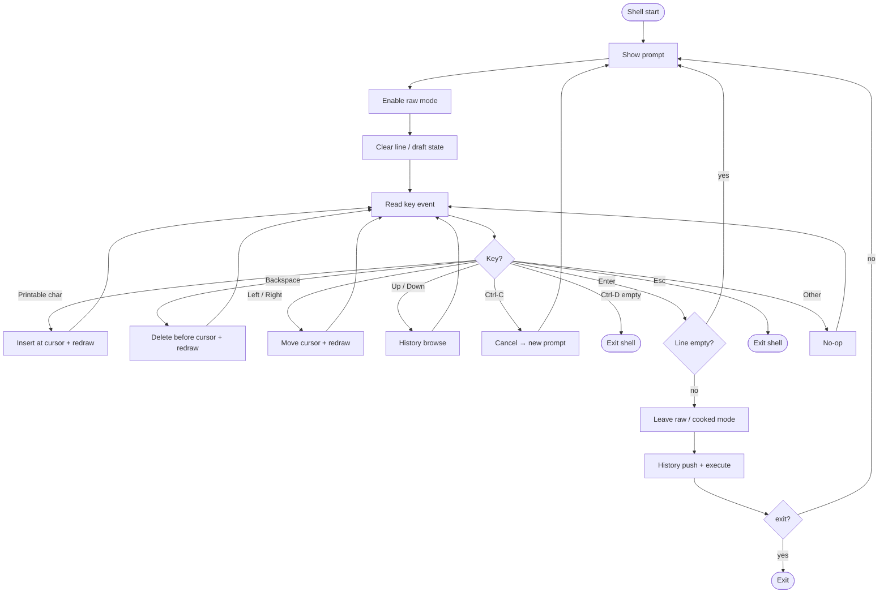

# Interactive line editing

How Wish collects a command line before execution.

The prompt runs in **raw mode** so each keystroke is handled immediately. A `cursor_pos` marks the caret (ASCII / byte-oriented). Insert and Backspace act at the caret, not only at the end of the line.

Related: [Command history](command-history.md) · [Execution](execution.md)

## Flow

## Raw vs cooked

| Phase | Mode | Why |
|-------|------|-----|
| Editing the line | **Raw** | Keystrokes arrive one at a time; the shell draws the line itself |
| Running a command | **Cooked** | Child processes expect normal terminal line discipline |

Wish uses a RAII guard (`TerminalRawMode`): raw while the guard lives; cooked again when it drops — including before execute.

## Keys

| Input | Behavior |
|-------|----------|
| Printable character | Insert at caret, move caret right, redraw |
| Backspace | Delete the character before the caret (no-op at column 0) |
| Left / Right | Move caret within the line |
| Up / Down | Browse history ([details](command-history.md)); caret jumps to end of the loaded line |
| Ctrl-C | Discard the line → new prompt |
| Ctrl-D (empty line) | Exit the shell |
| Enter | Submit (below) |
| Esc | Exit the shell |

## Submit

1. Move to the next screen line (`\r\n`).
2. Empty line (after trim) → new prompt, nothing runs.
3. Leave raw mode.
4. Push into history when policy allows.
5. Execute the line; if the `exit` builtin ran, leave the shell; otherwise show a new prompt.

## Redraw

Each visible change repaints the current row as `prompt + input_line`, clears leftover characters to the end of the line, then places the caret at `prompt.len() + cursor_pos`.
